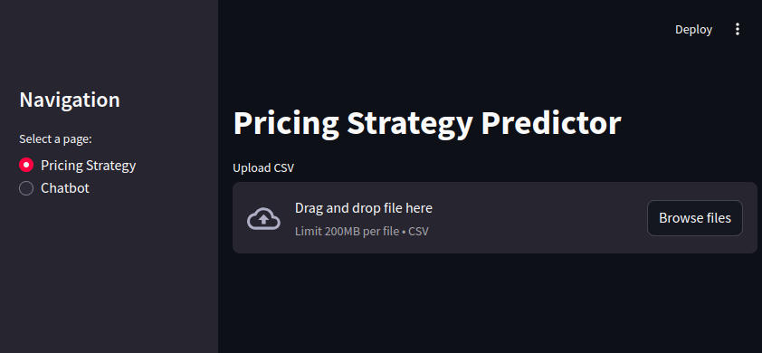

# Personalized Conversational eCommerce System

Welcome to the Personalized Conversational eCommerce System, a Streamlit application that utilizes a chatbot for enhanced customer interaction and dynamic pricing strategies. This app is designed to create a more engaging and personalized shopping experience, allowing users to receive tailored product recommendations and pricing based on their preferences and market trends.

## Table of Contents

- [Features](#features)
- [Project Structure](#project-structure)
- [Installation](#installation)
- [Usage](#usage)
- [Requirements](#requirements)
- [Future Improvements](#future-improvements)
- [Contributing](#contributing)
- [License](#license)

## Features

- **Conversational AI Chatbot**: Engage with customers through a chatbot that understands user queries and provides personalized product recommendations.
- **Dynamic Pricing Strategies**: Implement machine learning algorithms to adjust pricing based on market trends and customer demand.
- **User-Friendly Interface**: Built using Streamlit for an intuitive and responsive user experience.
- **Data-Driven Insights**: Utilize historical data to enhance product recommendations and pricing strategies.

## Project Structure
.
├── app.py
├── artifacts
│   └── best_model.pth
├── chatbot_api.py
├── dataset
│   ├── df_sampled_olist.csv
│   ├── olist_test_sample.csv
│   └── prompt_data.csv
├── doc
│   ├── Chatbot report.docx
│   └── st.png
├── Notebooks
│   ├── e-commerce-chatbot-olsit-dialo.ipynb
│   ├── e_commerce_chatbot_olsit_gpt2.ipynb
│   ├── Olist_dataset_preparation
│   └── Olist_pricing.ipynb
├── pricing_model.py
├── __pycache__
│   ├── chatbot_api.cpython-310.pyc
│   ├── chatbot_api.cpython-38.pyc
│   └── pricing_model.cpython-38.pyc
├── README.md
├── requirements.txt
└── test
    ├── chatbot_app.py
    ├── model_test.py
    └── streamlit_batch

